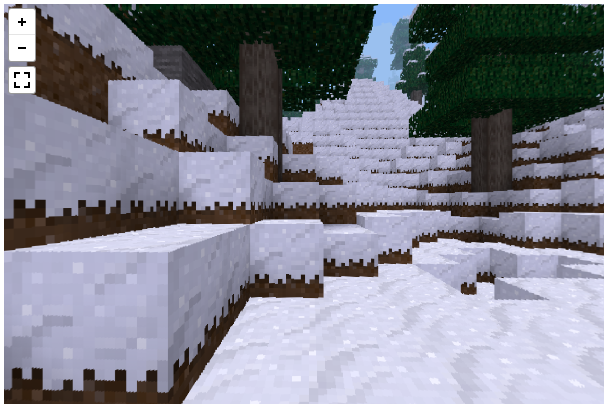

<!---
Author: Aivree Gomez
Date: 26 February 2020
linkcolor: blue
documentclass: scrartcl
fontfamily: noto
fontfamilyoptions:
- sfdefault
margin-left: 0.75in
margin-right: 0.75in
header-includes: |
  \usepackage{fancyhdr}
  \pagestyle{fancy}
  \fancyhf{}
  \lfoot{Created by Aivree Gomez}
  \rfoot{26 February 2020}
# PDF version generated with Pandoc
--->

# Embedding Panoramas with [Panellum](https://pannellum.org)

## Purpose

This guide will show you how to embed a 360 panorama viewer into your webpage. 
This is not a complete guide for the bells and whistles available, but is a functional starting point.

## Preface 

This guide uses the Panellum API (Application Programming Interface) to embed the panorama. 
You may alternatively use `<iframe>` tags to place your viewer.
A tutorial for that method can be found on the Penellum website [here](https://pannellum.org/documentation/overview/).

## Step 1 &mdash; Image Hosting

Before any webpage shenanigans, make sure the photo(s) you want to use are hosted somewhere publicly accessible. 
This can be accomplished by using a public Google Drive, Dropbox, or an image hosting site such as [Imgur](https://imgur.com).
Then keep track of those url(s)/link(s).
You want a link to **the image itself**, not the webpage the image is being displayed on. 
You can usually tell the difference when it ends in *.jpg*, *.jpeg*, *.png*, etc.
For example: *https://imgur.com/gallery/qxrvBJa* vs *https://i.imgur.com/qxrvBJa.png*

## Step 2 &mdash; Prepare Webpage

A simple working viewer takes minimal setup. 
If you are working in a visual/drag-and-drop style webpage creation software, find how to get to the page's source code editor.
In the `<head>` tag at the top of the page's *html* file, add the following tags to import the Panellum functionality:
```html
<link rel="stylesheet" 
  href="https://cdn.jsdelivr.net/npm/pannellum@2.5.6/build/pannellum.css"/>
<script type="text/javascript" 
  src="https://cdn.jsdelivr.net/npm/pannellum@2.5.6/build/pannellum.js">
</script>
```

Then, also in the `<head>` tag, add this `<style>` tag to specify the size of the viewer:
```html
<style>
  #panorama-viewer {
    width: 600px;
    height: 400px;
  }
</style>
```

There are better places to put this styling, and if you know where that is, I encourage you to do so. 
If you are interested in learning more about styling, checkout the [W3 Schools CSS Tutorial](https://www.w3schools.com/css/default.asp).

## Step 3 &mdash; Place Viewer

The viewer itself takes the form of a simple `<div>` tag:
```html
<div id="panorama-viewer"></div>
```
The placement of this `<div>` dictates where on the page the viewer is rendered. 

The following `<script>` tag should be placed at the bottom of the `<body>` tag.
```html
<script>
  pannellum.viewer('panorama-viewer', 
    {
      "type": "equirectangular",
      "panorama": "https://i.imgur.com/qxrvBJa.png",
      "autoLoad": true,
      "autoRotate": 5
    }
  );
</script>
```
<!--
\newpage
-->

## Congrats!



You should now have a working panorama viewer similar to this one spinning nicely.
Like I said in the beginning, this is a minimum viable viewer. 
If you want to get fancier, Panellum has lots of great features and configuration options.


## External Links

You can find examples of additional functionality on Panellum's site [here](https://pannellum.org/documentation/examples/simple-example/). 

You can also find all the configuration options [here](https://pannellum.org/documentation/reference/).

You can see the page above [here](https://aivreeg.github.io/Simple-Panorama-Page/), and the source code for that page [here](https://github.com/aivreeg/Simple-Panorama-Page).
